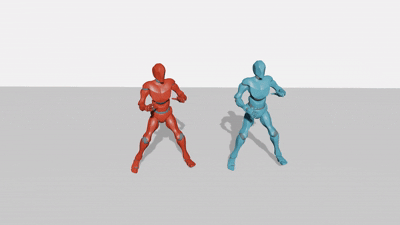
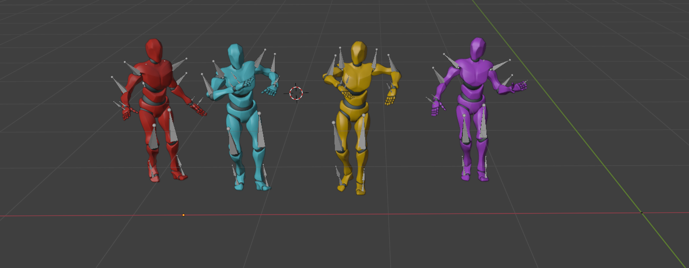

# TCDiff++
Code for our paper "TCDiff++: An End-to-end Trajectory-Controllable Diffusion Model for Harmonious Music-Driven Group Choreography". 


<p align="center">
  <em>✨ If you like this project, feel free to give TCDiff++ a star ✨.</em>
</p>

<p align="center">
  
</p>

<p align="center">
  <a href="https://arxiv.org/pdf/2506.18671">
    
  </a>
  <a href="https://da1yuqin.github.io/TCDiffpp.website/">
    
  </a>
  <!-- <a href="https://da1yuqin.github.io/TCDiffpp.website/">
    
  </a> -->
  <a href="https://wanluzhu.github.io/TCDiffusion/">
    
  </a>
</p>


## 📌 TODO List
🥳 We plan to open source the following parts in September:

- [ ] Data Preprocess  
- [ ] Train    
- [ ] Long Generation  
- [ ] Blender Visualization  


<!-- ## Environment Setup

* To set up the environment, follow these steps:

```bash
# Create a new conda environment
conda create -n tcdiffpp python=3.9
conda activate tcdiffpp

# Install PyTorch with CUDA support
conda install pytorch==2.0.0 torchvision==0.15.0 torchaudio==2.0.0 pytorch-cuda=11.7 -c pytorch -c nvidia

# Install additional dependencies
pip install mamba-ssm
conda install packaging

# Configure and install PyTorch3D
conda config --add channels https://mirrors.tuna.tsinghua.edu.cn/anaconda/cloud/pytorch3d/
conda install -c fvcore -c iopath -c conda-forge fvcore iopath 
conda install pytorch3d

# Install remaining requirements
pip install -r requirements.txt
pip install accelerate 
pip install librosa 
pip install matplotlib
pip install p_tqdm
```
* On certain hardware configurations, setting up an environment with SSM may encounter issues. Alternatively, you can use an environment without SSM and set the parameter `use_ssm` to `False`, which allows you to use the Transformer-based framework instead.
* We found that on certain devices, the script `create_dataset.py` has specific version requirements for NumPy (1.26.1 or 2.0.1), which may cause conflicts when setting up the environment (1.24.1) for `train.py` and `test.py`. The following actions may help resolve these issues:


```bash
pip install -U scipy
pip install -U librosa
pip install -U numpy
pip install numpy==x.x.x
```

# Data Preprocess
1. Please download AIOZ-GDance from [here](https://github.com/aioz-ai/AIOZ-GDANCE) and place it in the `./data/AIOZ_Dataset` path.


2. Run the Preprocessing Script:
```bash
cd data/
python create_dataset.py
```


# Training
To train the model, use the following command:

    accelerate launch train.py


# Generate results
To generate results using the trained model, run:

    python train.py --mode "val" 

# Long group dance generation
To perform Long-duration generation, execute:

    python long_generation.py --required_dancer_num 4 --genre Electronic 
 

# Visulization in Blender
We developed automated scripts to transform the generated SMPL motion data into beautiful 3D animations rendered in Blender, replicating the high-quality visuals featured on our project page. The entire rendering pipeline, from data preparation to Blender rendering, is fully scripted for ease of use and reproducibility. For detailed steps, please refer to the `Blender_Visulization/` Rendering Pipeline documentation.  ✨ Your star is the greatest encouragement for our work. ✨



## Acknowledgment
The concept of TCDiff is inspired by solo-dancer generation model [EDGE](https://github.com/Stanford-TML/EDGE) and [Mamba](https://github.com/state-spaces/mamba).
We sincerely appreciate the efforts of these teams for their contributions to open-source research and development. -->

# Citation
```
@article{dai2025tcdiff++,
  title={TCDiff++: An End-to-end Trajectory-Controllable Diffusion Model for Harmonious Music-Driven Group Choreography},
  author={Dai, Yuqin and Zhu, Wanlu and Li, Ronghui and Li, Xiu and Zhang, Zhenyu and Li, Jun and Yang, Jian},
  journal={arXiv preprint arXiv:2506.18671},
  year={2025}
}
@article{dai2024harmonious,
  title={Harmonious Group Choreography with Trajectory-Controllable Diffusion},
  author={Dai, Yuqin and Zhu, Wanlu and Li, Ronghui and Ren, Zeping and Zhou, Xiangzheng and Li, Xiu and Li, Jun and Yang, Jian},
  journal={arXiv preprint arXiv:2403.06189},
  year={2024}
}
```